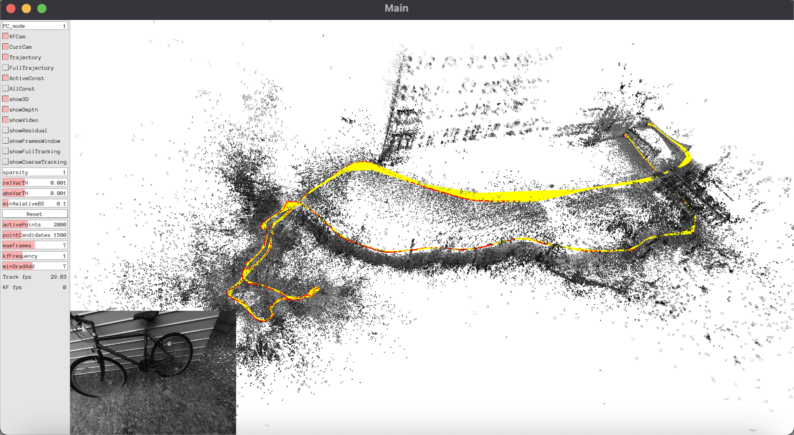

# QPEP-DSO: Quadratic Pose Estimation Problems (QPEP) Enhanced Direct Sparse Odometry with Loop Closure

## Code Arch
The codes are motivated by DSO (https://github.com/JakobEngel/dso) by Engel et al. and LDSO (https://github.com/tum-vision/LDSO) by Xiang Gao et al.

## Related Publications



 * **LDSO: Direct Sparse Odometry with Loop Closure**, *X. Gao, R. Wang, N. Demmel, D. Cremers*,
   In International Conference on Intelligent Robots and Systems (IROS), 2018.
 * **Direct Sparse Odometry**, *J. Engel, V. Koltun, D. Cremers*,
   In IEEE Transactions on Pattern Analysis and Machine Intelligence (PAMI), 2018
 * **A Photometrically Calibrated Benchmark For Monocular Visual Odometry**, *J. Engel, V. Usenko, D. Cremers*,
   In arXiv:1607.02555, 2016
 * **Quadratic Pose Estimation Problems: Unified Solutions, Solvability/Observability Analysis and Uncertainty Description in A Globally Optimal Framework*,
   2020, https://github.com/zarathustr/QPEP

## Run
 - TUM-Mono Dataset: [https://vision.in.tum.de/mono-dataset](https://vision.in.tum.de/mono-dataset)

To run QPEP-DSOP on TUM-Mono dataset sequence 34, execute:

```
./bin/run_dso_tum_mono \
    preset=0 \
    files=XXXXX/TUMmono/sequences/sequence_34/images.zip \
    vignette=XXXXX/TUMmono/sequences/sequence_34/vignette.png \
    calib=XXXXX/TUMmono/sequences/sequence_34/camera.txt \
    gamma=XXXXX/TUMmono/sequences/sequence_34/pcalib.txt \
    method=QPEP-RANSAC
```

